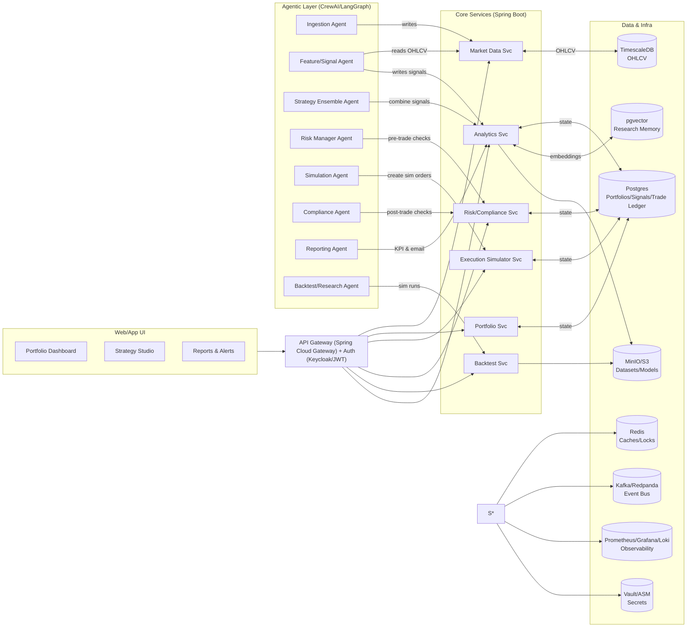

# High‑Level Design (HLD): Agentic AI Portfolio Manager (Multi‑Asset)

**Version:** 1.0  
**Date:** 2025‑08‑27  
**Authors:** Platform/AI Architecture  
**Stakeholders:** Quant Research, Trading Ops, SRE, Security, Compliance, Product

---

## 1. Executive Summary
A modular, multi‑agent system that ingests market data (stocks/ETFs/crypto/forex), generates signals via multiple strategies, ensembles them into portfolio targets, enforces risk/compliance, and routes paper/live orders to brokers. The platform supports backtesting, walk‑forward evaluation, and continuous promotion of strategies with robust observability and governance.

**Primary outcomes**
- Data‑driven portfolio management with explainable signals
- Risk‑aware execution (pre/post‑trade checks; kill‑switches)
- Daily/weekly analytics, drift detection, and reporting
- Extensible connectors for brokers, data vendors, and strategies

---

## 2. Goals & Non‑Goals
**Goals**
- Support multi‑asset OHLCV ingestion (intraday & daily) with up to 5k symbols
- Multi‑strategy signals (EMA/RSI, momentum, mean‑reversion, pairs) and ensemble
- Paper/simulation only; **no external broker integrations**
- SLOs: EOD pipeline ≤ 15 min; order submit p95 ≤ 800 ms; dashboard p95 ≤ 400 ms
- Guardrails: Max drawdown cutoffs, exposure caps, compliance blacklists

**Non‑Goals**
- HFT/ultra‑low‑latency trading (<10 ms)  
- Exotic derivatives pricing engines  
- Co‑located exchange connectivity

---

## 3. Personas & Use Cases
**Personas:** Quant Researcher, Portfolio Manager, Trading Ops, Compliance Officer, SRE, Executive.  
**Key Use Cases:** Daily portfolio rebalance; intraday anomaly alerting; strategy AB tests; compliance attestations; performance reporting; sandbox backtests; live cutover with paper guardrails.

---

## 4. Scope
**In‑Scope**: Data ingestion, signal generation, ensemble, risk/compliance checks, order routing, reporting, backtesting, dashboards, observability, CI/CD, access control.  
**Out‑of‑Scope**: Tax lot optimization, investor accounting, and client reporting statements.

---

## 5. Requirements

### 5.x Watchlist
- Users can create and manage **Watchlists** of symbols (stocks, ETFs, crypto, forex).
- Each watchlist can be tied to a portfolio or standalone.
- Signals and KPIs can be filtered or aggregated by watchlist.
- APIs: `POST /api/watchlists`, `GET /api/watchlists/{id}`, `POST /api/watchlists/{id}/symbols`.
- DB: `watchlist(id, name, user_id, created_at)`; `watchlist_symbol(watchlist_id, symbol)`.

### 5.1 Functional
1. Ingest OHLCV for multiple venues/timeframes; dedupe, late‑arrivals handling
2. Calculate indicators and produce strategy‑level signals with reasons
3. Ensemble signals into target weights by portfolio
4. Pre‑trade risk checks; position sizing (Kelly‑bounded; vol‑scaled)
5. Route orders (paper/live), track lifecycle; bracket orders (SL/TP)
6. Post‑trade compliance checks and audit trail
7. EOD/weekly reports (PNL, hit‑rate, Sharpe, exposures, drawdown)
8. Backtest & walk‑forward; model registry; promotion gates

### 5.2 Non‑Functional
- **Availability:** 99.9% (core APIs); **RTO/RPO:** 1h/15m  
- **Security:** SSO (OIDC), RBAC, least‑privilege, audit logging  
- **Scalability:** 5k symbols × 5 timeframes; 50 rps control plane  
- **Data retention:** candles ≥ 3y; orders/trades ≥ 7y; logs 30d hot, 365d cold  
- **Observability:** Metrics, traces, logs with SLOs & alerting  
- **Cost:** Tiered storage (hot TSDB; cold S3); autoscale workers

---

## 6. Architecture Overview


**Patterns:** Event‑driven (Kafka) + request/response (REST). Idempotent writes. Backpressure and retries with DLQs.

---

## 7. Component Design
### 7.1 Agentic Layer
- **Ingestion Agent:** Schedules pulls; validates schema; late‑bar reconciliation; emits `md.candles.{tf}` events.
- **Feature/Signal Agent:** Computes indicators (EMA/RSI/MACD/ATR/vol); outputs `signals.raw` with `score`, `direction`, `reason` (JSON).
- **Strategy Ensemble Agent:** Blends signals via stacking/voting weighted by live Sharpe/hit‑rate; emits `signals.ensemble` (target weights).
- **Risk Manager Agent:** Applies exposure caps (per asset/sector), VaR/MDD guardrails, slippage models; approves or rejects intents.
- **Execution Agent:** Translates intents to orders; supports bracket orders, TIFs; handles broker acks via Webhook Svc.
- **Compliance Agent:** Enforces blacklists, market hours, leverage rules; maintains audit trail.
- **Reporting Agent:** Generates EOD/weekly PDFs; anomaly alerts (drawdown breaches, drift).
- **Backtest/Research Agent:** Walk‑forward, hyperparam search; pushes artifacts to model store; updates weights.

### 7.2 Core Services (Spring Boot)
- **Market Data Svc:** TimescaleDB access; OHLCV APIs; caching; gap detection.  
- **Portfolio Svc:** Portfolios, positions, exposures; KPI aggregation.  
- **Order Svc:** Order intent → broker routing; idempotency; state machine for order lifecycle.  
- **Risk/Compliance Svc:** Rule engine (JSON/YAML), policy evaluation, attestations.  
- **Backtest Svc:** Batch/backfill runners, replay framework, metrics.  
- **Analytics Svc:** Signal store, feature registry, pgvector search; report assembly.  
- **Webhook Svc:** Receives broker fills/cancels; reconciles positions.

---

## 8. Data Model
### 8.1 ER (simplified)


### 8.2 Time‑series schema (TimescaleDB)
- Hypertable `candle(symbol, venue, tf, ts)` with compression after 30d hot; continuous aggregates for daily/weekly KPIs.
- Index: `(symbol, tf, ts desc)`; retention policies per tf.

### 8.3 Vector store
- `research_note(id, symbol, content, embedding vector(1536), created_at)` for semantic recall of research/rationales.

---

## 9. Events & Schemas
**Topics**
- `md.candles.{tf}`
- `signals.raw`
- `signals.ensemble`
- `risk.check.request` / `risk.check.result`
- `orders.intent` / `orders.submitted` / `orders.filled`
- `alerts.events`
- `reports.eod`

**Example payloads**
```json
// signals.raw
{
  "symbol": "AAPL", "tf": "1d", "strategy": "ema_rsi_v1",
  "direction": "LONG", "score": 0.63,
  "reason": {"ema20_gt_ema50": true, "rsi14": 58.9, "breakout_z": 1.2},
  "generated_at": "2025-08-27T16:00:00Z"
}
```
```json
// signals.ensemble
{
  "portfolio_id": "...",
  "targets": [{"symbol": "AAPL", "weight": 0.06}, {"symbol": "MSFT", "weight": 0.05}],
  "method": "stacked_v1", "metrics": {"live_sharpe": 1.3, "hit_rate": 0.57},
  "asof": "2025-08-27T16:05:00Z"
}
```
```json
// orders.filled
{
  "order_id": "...", "symbol": "AAPL", "side": "BUY",
  "filled_qty": 50, "avg_fill_price": 214.32, "ts": "2025-08-27T16:06:21Z"
}
```

---

## 10. Public APIs (selected)
- `GET /api/market/candles?symbol=TSLA&tf=1d&from=...&to=...`  
- `POST /api/signals` — ingest third‑party signals  
- `POST /api/portfolio/{id}/rebalance` — set target weights  
- `GET /api/portfolio/{id}/kpis?window=30d`  
- `POST /api/orders` — paper/live via header `X-TRADING-MODE`  
- `POST /api/webhooks/broker` — exec updates (authenticated allowlist)

**Headers:** `Authorization: Bearer <JWT>`, `Idempotency-Key` for POSTs.  
**Error model:** RFC7807 (problem+json).  

---

## 11. Key Flows
### 11.1 Daily Ingest → Signals → Targets


### 11.2 Rebalance & Execution


### 11.3 Kill‑Switch (MDD breach)


---

## 12. Deployment Topology
- **Dev:** Docker Compose (TimescaleDB, Postgres, Redis, Redpanda, MinIO, Keycloak, services, agents)  
- **Prod:** Kubernetes (EKS/GKE/AKS)
  - Namespaces: `core`, `agents`, `data`, `observability`  
  - HPA on agents; VPA on services with CPU/mem requests  
  - Ingress: NGINX or API Gateway; mTLS service mesh (Istio/Linkerd optional)
  - Node pools: general‑purpose for services; compute‑optimized for backtests

**CI/CD:** GitHub Actions → container scan → unit/integration → backtest smoke → canary deploy (ArgoCD).

---

## 13. Security & Compliance
- **AuthN/Z:** Keycloak (OIDC), RBAC by role (PM, Quant, Ops, Viewer)  
- **Secrets:** Vault/ASM/SM; no secrets in env; rotate keys  
- **Data:** TLS in transit; at‑rest encryption (PG, S3)  
- **Network:** Private subnets for data plane; SG/NSG allowlists; WAF at edge  
- **Audit:** Every decision/event persisted; immutable logs to S3 with lifecycle  
- **Compliance:** Blacklists, market‑hours, leverage caps; attestations & sign‑offs

---

## 14. Observability & SRE
- **Metrics:** Prometheus (service, strategy KPIs, order latencies)  
- **Logs:** Loki; structured JSON; correlation IDs  
- **Traces:** OpenTelemetry → Tempo/Jaeger; golden signals dashboards  
- **SLOs:** API p95 latency, success rate, data freshness; error budgets  
- **Alerts:** Data gaps, drift, MDD breaches, broker rejects, DLQ growth

---

## 15. Resilience & Quality
- Idempotent POSTs (Idempotency‑Key); retries with jitter; DLQs  
- Bulkheads: separate pools for ingest vs execution  
- Circuit breakers around data vendors/brokers  
- Schema contracts (JSON Schema/Avro) w/ compatibility gates  
- Data‑quality checks: nulls, outliers, missing bars, duplicates

---

## 16. Data Management
- **Retention:** OHLCV hot 90d (compressed thereafter); orders 7y; signals 1y  
- **Backups:** PITR for PG/Timescale; S3 versioning; quarterly DR drills  
- **Privacy:** Minimal PII; user accounts only; no client funds data

---

## 17. Risks & Mitigations
- **Vendor outages:** Multi‑provider failover, cached bars, DLQs  
- **Model drift:** Live KPI monitoring; auto‑downgrade weights; human review  
- **Regulatory change:** Policy rules in config; attestation workflows  
- **Over‑fitting:** Walk‑forward, out‑of‑sample, nested CV; promotion gates  
- **Execution slippage:** Slippage model; post‑trade analytics; adjust sizing

---

## 18. Testing Strategy
- Unit & property‑based tests (signals, sizing)  
- Integration: service + DB + Kafka testcontainers  
- Contract tests (OpenAPI, Avro)  
- Backtest harness: golden datasets; reproducible seeds  
- Chaos drills: broker timeouts, stale data, DLQ replay

---

## 19. Phased Rollout
1. **P1:** Compose stack; ingest + EMA/RSI; paper orders; dashboards  
2. **P2:** Risk rules; EOD reports; kill‑switch  
3. **P3:** Backtests; promotion gates; ensemble  
4. **P4:** Crypto/forex connectors; sector caps  
5. **P5:** Limited live trading; post‑trade analytics

---

## 20. Open Questions
- Target universes & symbol counts per asset class?  
- Broker priority (Alpaca, IBKR, Binance)?  
- SLOs for intraday strategies vs daily?  
- Compliance rule sources (internal vs external list providers)?

---

## Appendix A — Tech Stack (Recommended)
- **Services:** Spring Boot 3 (Java 21), Spring Cloud Gateway, Spring Security JWT  
- **Agents:** Python (CrewAI/LangGraph), pandas/numba/TA‑Lib/pydantic  
- **Data:** TimescaleDB, Postgres 16, pgvector, Redis 7  
- **Events:** Redpanda/Kafka  
- **Storage:** MinIO/S3  
- **Security:** Keycloak, Vault/ASM/SM  
- **Obs:** Prometheus, Grafana, Loki, Tempo/Jaeger  
- **Deploy:** Docker Compose → K8s (ArgoCD)

## Appendix B — Sample Strategy Config (YAML)
```yaml
name: ema_rsi_v1
universe: [AAPL, MSFT, TSLA, NVDA, QQQ, SPY, BTCUSD, ETHUSD]
timeframe: 1d
entry:
  rules:
    - close > ema_50
    - ema_20 > ema_50
    - rsi_14 > 55
exit:
  rules:
    - rsi_14 < 45
sizing:
  max_asset_pct: 0.08
  max_sector_pct: 0.25
  gross_leverage: 1.2
  kelly_multiplier: 0.25
risk:
  stop_loss_pct: 0.06
  take_profit_pct: 0.12
  trailing_stop_atr_mult: 2.5
```

## Appendix C — Sample Docker Compose (Excerpt)
```yaml
services:
  postgres:
    image: timescale/timescaledb-ha:pg16
    environment:
      POSTGRES_PASSWORD: pgpass
      POSTGRES_USER: pguser
      POSTGRES_DB: portfolio
    ports: ["5432:5432"]
  redis:
    image: redis:7
    ports: ["6379:6379"]
  redpanda:
    image: redpandadata/redpanda:latest
    command: redpanda start --overprovisioned --smp 1 --memory 512M --mode dev-container
    ports: ["9092:9092","9644:9644"]
  minio:
    image: minio/minio
    command: server /data
    environment:
      MINIO_ROOT_USER: minio
      MINIO_ROOT_PASSWORD: minio123
    ports: ["9000:9000","9001:9001"]
```


---

## Brokerless Variant — No External Broker Integrations

### Summary
This addendum tailors the platform for **simulation/paper trading only**. There is **no connectivity to external brokers**. Orders are simulated via an **Execution Simulator Service** with configurable **fill models** and a persistent **Trade Ledger**. All risk/compliance checks still run, but post‑trade actions are recorded only in the ledger.

### Architectural Changes (Brokerless)


### New/Changed Components
- **Execution Simulator Service (S3):**
  - Accepts **order intents** and simulates fills using configured **fill models** (see below).
  - Maintains **Trade Ledger**: simulated orders, executions, P&L, positions.
  - Supports bracket/OTOCO logic (SL/TP), partial fills, slippage and latency.
- **Simulation Agent (A5):**
  - Converts portfolio targets → order intents; interacts only with Execution Simulator.
  - Can run in **intraday** or **EOD** modes with batch sizing and throttling.

### Fill Models (Configurable)
- **Market‑Mid:** fill at `close` or `vwap` of the bar; latency L seconds.
- **Limit‑Cross:** fill if `high>=limit` (buy) or `low<=limit` (sell); partial fills via volume share.
- **Arrival‑Price:** `price = open + slip(bps)`; slippage = f(ATR%, notional).
- **Custom:** Python plugin: `price, qty = f(bar, order, liquidity)`.

### Data Model Additions (Postgres)
```sql
CREATE TABLE sim_order (
  id UUID PRIMARY KEY,
  portfolio_id UUID REFERENCES portfolio(id),
  symbol TEXT, side TEXT, qty NUMERIC, order_type TEXT,
  limit_price NUMERIC, stop_loss NUMERIC, take_profit NUMERIC,
  tif TEXT, created_at TIMESTAMPTZ DEFAULT now(), status TEXT
);

CREATE TABLE sim_fill (
  id UUID PRIMARY KEY,
  order_id UUID REFERENCES sim_order(id),
  filled_qty NUMERIC, fill_price NUMERIC,
  slippage_bps NUMERIC, model TEXT, ts TIMESTAMPTZ
);

CREATE TABLE fill_model_config (
  id UUID PRIMARY KEY,
  name TEXT UNIQUE, params JSONB, active BOOLEAN DEFAULT true, created_at TIMESTAMPTZ DEFAULT now()
);
```

### Brokerless Event Topics
- `sim.orders.intent` / `sim.orders.submitted` / `sim.orders.filled`
- `sim.ledger.updated`
- Retain existing `signals.*`, `alerts.events`, `reports.eod`.

### Public APIs (Brokerless)
- `POST /api/simulate/rebalance` — set target weights and generate **simulated** orders
- `POST /api/simulate/orders` — submit explicit simulated orders
- `GET /api/sim/ledger?portfolio=...&window=30d` — executions & PnL
- `POST /api/fill-models` — register/select fill models

**Headers:** `Authorization: Bearer <JWT>`, `Idempotency-Key` for POSTs.

### Key Flows (Brokerless)


### Observability (Additions)
- Track **model vs realized** slippage error, **fill rate**, **latency**, and **backfill consistency**.

### Risks & Mitigations (Brokerless)
- **Execution realism gap:** Validate fill models against historical intraday bars; calibrate slippage.
- **Data gaps:** Guard with freshness alerts, interpolation bans for trading periods.
- **Over‑optimism:** Penalize fills during low liquidity; cap participation rate.

### Updated Goals
- Explicitly **no live trading**; all execution is simulated. Focus on **research, paper trading, and analytics**.

