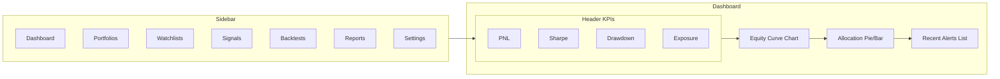
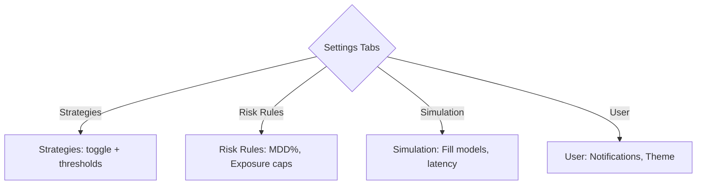

# UI Wireframes (Low‑Fidelity, Mermaid)

This document outlines low‑fidelity UI wireframes for the **Agentic AI Portfolio Manager (Multi‑Asset)**. Each screen is represented as a Mermaid diagram for inclusion in documentation or design reviews.

---

## 1. Dashboard


---

## 2. Portfolio Detail
```mermaid
flowchart TB
  HDR[Portfolio Header: Name | Base CCY | Created]
  TABS{Tabs}
  OV[Overview]
  ORD[Orders]
  KPI[KPIs]
  ALLOC[Allocation by Asset Chart]
  POS[Positions Table]
  OOPEN[Open Orders Table]
  OHIST[Historical Orders Table]
  PNL[PnL Line Chart]
  RISK[Risk Metrics Table]

  HDR --> TABS
  TABS -->|Overview| OV
  TABS -->|Orders| ORD
  TABS -->|KPIs| KPI

  OV --> ALLOC
  OV --> POS
  ORD --> OOPEN
  ORD --> OHIST
  KPI --> PNL
  KPI --> RISK
```

---

## 3. Watchlist Detail
```mermaid
flowchart TB
  WHDR[Watchlist Header: Name | Count]
  WTOOLS[Actions: Add Symbol | Remove | Save]
  WTABLE[Symbols Table: Symbol | Price | %Chg | Last Signal | Vol | Add→]
  WSPARK[Inline Sparklines per Symbol]

  WHDR --> WTOOLS --> WTABLE --> WSPARK
```

---

## 4. Signals Stream
```mermaid
flowchart TB
  FILTER[Filter Bar: Symbol | Strategy | TF | Score Range]
  STABLE[Signals Table: Symbol | TF | Strategy | Dir | Score | Time]
  MODAL[Signal Detail Modal: Chart + JSON Reason]

  FILTER --> STABLE
  STABLE -->|Row click| MODAL
```

---

## 5. Backtests
```mermaid
flowchart TB
  BLIST[Backtest Runs: Strategy | Period | Sharpe | HitRate | Status]
  BDETAIL[Backtest Detail]
  BEQ[Equity Curve Chart]
  BDD[Drawdown Chart]
  BMET[Metrics: Sharpe | Sortino | MaxDD | CAGR]
  BGRID[Param Config Grid]

  BLIST -->|Select run| BDETAIL
  BDETAIL --> BEQ
  BDETAIL --> BDD
  BDETAIL --> BMET
  BDETAIL --> BGRID
```

---

## 6. Settings


---

## Notes
- These wireframes are **low‑fidelity** and focus on layout and flow, not styling.
- Intended for early‑stage review with stakeholders before building high‑fidelity mockups or React components.
- Can be rendered in Markdown tools that support Mermaid (e.g., GitHub, MkDocs, Obsidian).

